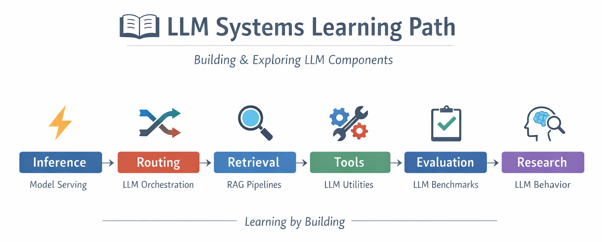

# Learning LLM Systems by Building

This organization is a collection of projects created during my journey of learning Large Language Models (LLMs), retrieval systems, and AI infrastructure.

Instead of only studying theory, I try to **learn by building real systems** — from inference servers to RAG pipelines and evaluation frameworks.

---

## What I'm Exploring

- How to serve models efficiently (GPU / TensorRT / batching)
- How to route and manage multiple LLMs
- How retrieval works (dense / sparse / hybrid / multi-vector)
- How to evaluate LLM outputs and reduce hallucination
- How to design practical LLM applications

---

## Project Overview

These projects are not perfect or production-ready — they reflect my **learning process and experiments**.

### Inference & Serving
- **[TensorRT Inference Server](https://github.com/LLMSystems/TensorrtServer)**  
  Exploring high-performance model serving and GPU optimization.

### Routing
- **[LLM Router Server](https://github.com/LLMSystems/LLM-Router-Server)**  
  Learning how to route requests across multiple models with load balancing.

### Retrieval & RAG
- **[Tiny-RAGFlow](https://github.com/LLMSystems/Tiny-RAGFlow)**  
  A lightweight RAG framework to understand hybrid retrieval and reranking.

### Tools
- **[LLM Tools](https://github.com/LLMSystems/llm_tools)**  
  A unified interface for interacting with LLMs, embeddings, and rerankers.

### Data Processing
- **[file2md](https://github.com/LLMSystems/file2md)**  
  Converting different file formats into Markdown for downstream LLM usage.

### Evaluation
- **[llm-evals](https://github.com/LLMSystems/llm-evals)**  
  Experimenting with LLM evaluation and LLM-as-a-judge approaches.

### Research Exploration
- **[Hallucination Mitigation (Behavior RL)](https://github.com/LLMSystems/BehaviorRL-Hallucination)**  
  Trying to solve LLMs hallucination.

### ML + Database
- **[ML2SQL](https://github.com/LLMSystems/ML2SQL)**  
  Exploring how ML models can run directly inside databases using SQL.

---

## Why This Exists

I believe the best way to understand LLM systems is to:

> **Build them piece by piece.**

Each repository focuses on a different part of the stack, and together they form a rough picture of how modern LLM systems work.

---

## Still Learning

This is an ongoing journey.  
Many things are incomplete, naive, or experimental — and that’s intentional.

If you’re also learning, feel free to explore, use, or build on top of these projects.